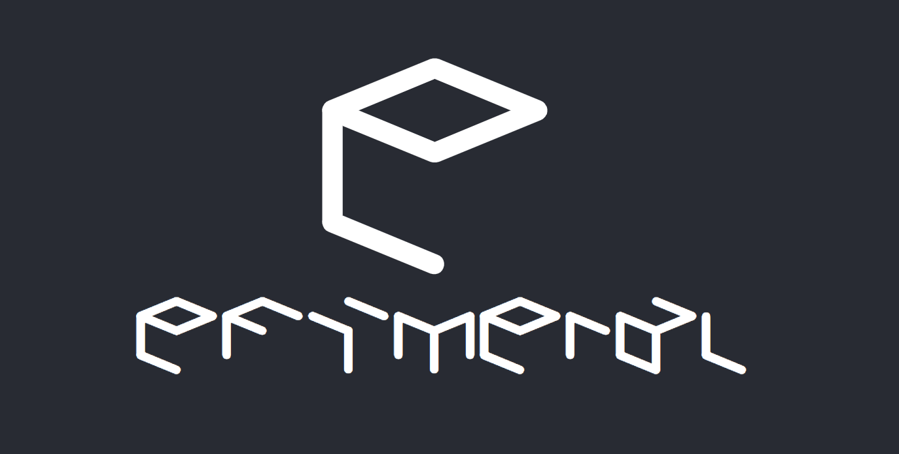

# Efimeral

Web servers in your browser! Efimeral can create _ephemeral_ Linux instances
for free, for a short period of time.

## Getting Started

These instructions will get you a copy of the project up and running on your
local machine for development and testing purposes. See deployment for notes on
how to deploy the project on a live system.

### Prerequisites

* NodeJS v12.6.0
* Yarn v1.15.2
* Golang v1.12.7
* Docker v17.12.0-ce
* docker-compose v1.18.0

For local development, domain `efimeral.com.ar` and `api.efimeral.com.ar` must
point to `localhost`:

```
# /etc/hosts
127.0.0.1 efimeral.com.ar
127.0.0.1 api.efimeral.com.ar
```

### Installing

Each sub-project has a `Makefile` with default target that builds & tests the
artifact (if some), builds the Docker image and pushes it into the Hub. All
sub-project is chained to a main `Makefile` in the project's root path:

```
$ make
```

## Built With

### Web

* [create-react-app](https://facebook.github.io/create-react-app/): React
  application scaffolnding.
* [Bootstrap](https://getbootstrap.com/): Style framework.
* [Font Awesome](https://fontawesome.com/): Nice font symbols.

### API

* [gin-gonic](https://gin-gonic.com/): Web framework for Golang.
* [testify](https://github.com/stretchr/testify): Test utilities.

### Docs

* [API Blueprint](https://apiblueprint.org/): High level description for API.
* [aglio](https://github.com/danielgtaylor/aglio): APIB renderer.

### For all

* [Nginx](https://www.nginx.com/): Simple web server.
* [CircleCI](https://circleci.com/): Continuous integration service.
* [Sentry](https://sentry.io): Production error tracker.

## Versioning

We use [SemVer](http://semver.org/) for versioning.

## License

This project is licensed under the GNU GPLv3 License; see the
[LICENSE.md](LICENSE.md) file for details.
